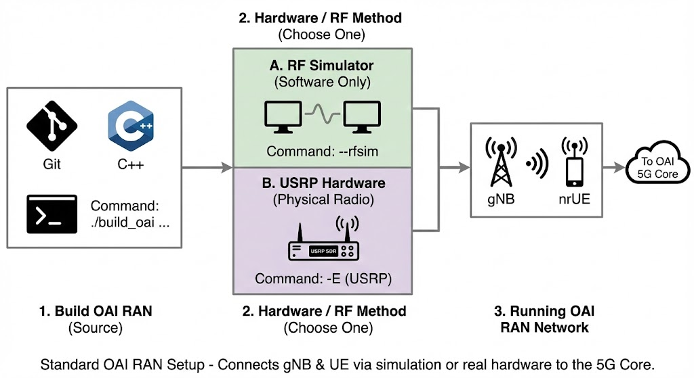
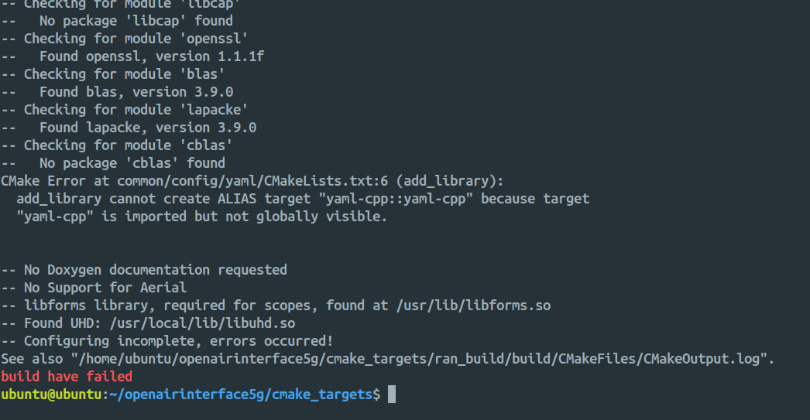

# OAI RAN Deployment Guide

This guide covers the deployment of the OpenAirInterface (OAI) Radio Access Network (RAN), including gNB and nrUE.



> [!NOTE]
>
> For the official documentation, please refer to the [OAI RAN Deployment Guide](https://gitlab.eurecom.fr/oai/openairinterface5g/-/blob/develop/doc/NR_SA_Tutorial_OAI_nrUE.md?ref_type=heads).
>
> This guide assumes you have already deployed the **OAI 5G Core**. Follow this [ngkore/OAI-CN5G](https://github.com/ngkore/OAI-CN5G) repository for core deployment instructions.

## 1\. System Preparation

### 1.1 Install General Dependencies

Install the necessary build tools and libraries for OAI.

```bash
sudo apt update
sudo apt install -y autoconf automake build-essential ccache cmake cpufrequtils \
  doxygen ethtool g++ git inetutils-tools libboost-all-dev libncurses-dev \
  libusb-1.0-0 libusb-1.0-0-dev libusb-dev python3-dev python3-mako \
  python3-numpy python3-requests python3-scipy python3-setuptools python3-ruamel.yaml \
  libcap-dev libblas-dev liblapacke-dev libatlas-base-dev
```

### 1.2 Install Scope Dependencies

Required for the `nrscope` visualization tool.

```bash
sudo apt install -y libforms-dev libforms-bin
```

### 1.3 Install `yaml-cpp` (Source Build Required)

> [!IMPORTANT]
> Do **not** install `yaml-cpp` using `sudo apt install libyaml-cpp-dev` as it is known to cause build failures (see below). Build it from source instead.



```bash
cd
git clone https://github.com/jbeder/yaml-cpp.git
cd yaml-cpp
mkdir build && cd build
cmake .. -DYAML_BUILD_SHARED_LIBS=ON
make -j$(nproc)
sudo make install
sudo ldconfig
cd
rm -r yaml-cpp/
```

### 1.4 Install UHD (Only for USRP Hardware)

If you are using **RF Simulator only**, you may skip this. For **USRP Hardware**, this is mandatory. Either follow the [UHD Build Guide](https://files.ettus.com/manual/page_build_guide.html) or use the commands below:

```bash
git clone https://github.com/EttusResearch/uhd.git ~/uhd
cd ~/uhd
git checkout v4.7.0.0
cd host
mkdir build
cd build
cmake ../
make -j $(nproc)
# make test # Optional
sudo make install
sudo ldconfig
sudo uhd_images_downloader
```

## 2\. Build OAI RAN

### 2.1 Clone Repository

```bash
git clone https://gitlab.eurecom.fr/oai/openairinterface5g.git ~/openairinterface5g
cd ~/openairinterface5g
# git checkout -f v2.1.0
git checkout develop
```

### 2.2 Install OAI dependencies

```bash
cd ~/openairinterface5g/cmake_targets
./build_oai -I
```

### 2.3 Build OAI gNB and nrUE

This command builds both the gNB and UE with support for the OAI Scope and Ninja build system.

```bash
cd ~/openairinterface5g/cmake_targets
./build_oai -w USRP --ninja --nrUE --gNB --build-lib "nrscope" -C
```

> [!NOTE]
> If you used docker compose to deploy OAI 5G Core (option A from ngkore/OAI-CN5G) then you likely do not need to make any changes. But if you used python wrapper to deploy OAI 5G (option B from ngkore/OAI-CN5G), then follow the step 5.

## 3\. Run OAI gNB

### USRP B210

```bash
cd ~/openairinterface5g/cmake_targets/ran_build/build
sudo ./nr-softmodem -O ../../../targets/PROJECTS/GENERIC-NR-5GC/CONF/gnb.sa.band78.fr1.106PRB.usrpb210.conf --gNBs.[0].min_rxtxtime 6 -E --continuous-tx
```

### USRP N300

```bash
cd ~/openairinterface5g/cmake_targets/ran_build/build
sudo ./nr-softmodem -O ../../../targets/PROJECTS/GENERIC-NR-5GC/CONF/gnb.sa.band77.fr1.273PRB.2x2.usrpn300.conf --gNBs.[0].min_rxtxtime 6 --usrp-tx-thread-config 1
```

### USRP X300

```bash
cd ~/openairinterface5g/cmake_targets/ran_build/build
sudo ./nr-softmodem -O ../../../targets/PROJECTS/GENERIC-NR-5GC/CONF/gnb.sa.band77.fr1.273PRB.2x2.usrpn300.conf --gNBs.[0].min_rxtxtime 6 --usrp-tx-thread-config 1 -E --continuous-tx
```

### RFsimulator

```bash
cd ~/openairinterface5g/cmake_targets/ran_build/build
sudo ./nr-softmodem -O ../../../targets/PROJECTS/GENERIC-NR-5GC/CONF/gnb.sa.band78.fr1.106PRB.usrpb210.conf --gNBs.[0].min_rxtxtime 6 --rfsim
```

### RFsimulator in FR2

```bash
cd ~/openairinterface5g/cmake_targets/ran_build/build
sudo ./nr-softmodem -O ../../../targets/PROJECTS/GENERIC-NR-5GC/CONF/gnb.sa.band257.u3.32prb.usrpx410.conf --rfsim
```

## 4\. Run OAI nrUE

### USRP B210

> [!NOTE]  
> This should be run in a second Ubuntu 22.04 host, other than gNB. <br>
> It only applies when running OAI gNB with USRP B210. <br>

```bash
cd ~/openairinterface5g/cmake_targets/ran_build/build
sudo ./nr-uesoftmodem -r 106 --numerology 1 --band 78 -C 3619200000 --ue-fo-compensation -E --uicc0.imsi 001010000000001
```

### RFsimulator

> [!NOTE]  
> This should be run on the same host as the OAI gNB. <br>
> It only applies when running OAI gNB with RFsimulator. <br>

```bash
cd ~/openairinterface5g/cmake_targets/ran_build/build
sudo ./nr-uesoftmodem -r 106 --numerology 1 --band 78 -C 3619200000 --uicc0.imsi 001010000000001 --rfsim
```

### RFsimulator in FR2

> [!NOTE]  
> This should be run on the same host as the OAI gNB. <br>
> It only applies when running OAI gNB with RFsimulator in FR2. <br>

```bash
cd ~/openairinterface5g/cmake_targets/ran_build/build
sudo ./nr-uesoftmodem -r 32 --numerology 3 --band 257 -C 27533280000 --uicc0.imsi 001010000000001 --ssb 72 --rfsim
```

## End-to-End Connectivity Test

Ping test from the UE host to the CN5G

```bash
ping 192.168.70.135 -I oaitun_ue1
```

---

## 5\. Steps to follow if using python wrapper for OAI 5G Core deployment

### 5.1 Configuration Changes

Apply the patch file:

```bash
git apply patch-files/openairinterface5g.patch
```

Or manually do these changes for consistent user profile across 5G Core and RAN:

```patch
diff --git a/targets/PROJECTS/GENERIC-NR-5GC/CONF/gnb.sa.band78.fr1.106PRB.usrpb210.conf b/targets/PROJECTS/GENERIC-NR-5GC/CONF/gnb.sa.band78.fr1.106PRB.usrpb210.conf
index 7f750d7259..4ae4fddca3 100644
--- a/targets/PROJECTS/GENERIC-NR-5GC/CONF/gnb.sa.band78.fr1.106PRB.usrpb210.conf
+++ b/targets/PROJECTS/GENERIC-NR-5GC/CONF/gnb.sa.band78.fr1.106PRB.usrpb210.conf
@@ -10,8 +10,8 @@ gNBs =
     gNB_name  =  "gNB-OAI";

     // Tracking area code, 0x0000 and 0xfffe are reserved values
-    tracking_area_code  =  1;
-    plmn_list = ({ mcc = 001; mnc = 01; mnc_length = 2; snssaiList = ({ sst = 1; }) });
+    tracking_area_code  =  0xa000;
+    plmn_list = ({ mcc = 208; mnc = 95; mnc_length = 2; snssaiList = ({ sst = 1; sd = 0xffffff; }) });

     nr_cellid = 12345678L;

diff --git a/targets/PROJECTS/GENERIC-NR-5GC/CONF/ue.conf b/targets/PROJECTS/GENERIC-NR-5GC/CONF/ue.conf
index 4cea93ea46..a6e099c89f 100644
--- a/targets/PROJECTS/GENERIC-NR-5GC/CONF/ue.conf
+++ b/targets/PROJECTS/GENERIC-NR-5GC/CONF/ue.conf
@@ -1,10 +1,10 @@
 uicc0 = {
-imsi = "2089900007487";
-key = "fec86ba6eb707ed08905757b1bb44b8f";
-opc= "C42449363BBAD02B66D16BC975D77CC1";
+imsi = "208950000000031";
+key = "0C0A34601D4F07677303652C0462535B";
+opc= "63bfa50ee6523365ff14c1f45f88737d";
 dnn= "oai";
 nssai_sst=1;
-nssai_sd=1;
+nssai_sd=0xffffff;
 }

 position0 = {
```

### 5.2 Run gNB (RF Simulator Mode)

Navigate to the build directory and run the gNB in RFsimulator mode:

```bash
cd openairinterface5g/cmake_targets/ran_build/build

sudo ./nr-softmodem \
  -O ../../../targets/PROJECTS/GENERIC-NR-5GC/CONF/gnb.sa.band78.fr1.106PRB.usrpb210.conf \
  -E \
  --rfsim \
  --rfsimulator.serveraddr server \
  --gNBs.[0].min_rxtxtime 6
```

### 5.3 Run NR UE (RFsim Mode)

```bash
sudo ./nr-uesoftmodem \
  -r 106 \
  --numerology 1 \
  --band 78 \
  -C 3619200000 \
  --rfsim \
  --rfsimulator.serveraddr 127.0.0.1 \
  -E \
  -O ../../../targets/PROJECTS/GENERIC-NR-5GC/CONF/ue.conf
```
